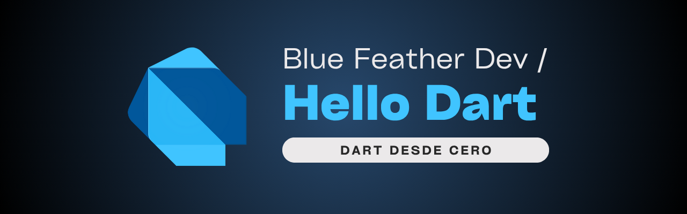

# Hello, Dart! 

 

Este repositorio es mi espacio de estudio personal para aprender y practicar el lenguaje **Dart**, paso a paso.

> Este repositorio está en constante crecimiento. Las carpetas se irán completando con ejemplos, notas y mejoras progresivamente.

## 🔎 ¿Qué encontrarás?

### 🗂️ Aprendizaje estructurado  

- Sintaxis y estructuras básicas (e.g. `variables/`, `control-flow/`, `functions/`)

- Programación orientada a objetos (e.g. `classes-&-objects/`)
- Funciones de alto orden, colecciones y tipos (e.g. `loops/`, `branches/`, `types/`)
- Asincronía (e.g. `async/await`, `Future` y `Stream`)
- Null safety y buenas prácticas (e.g. `null-safety/`, `effective-dart/`)
- Carpeta: [`language/`](./language/)

### 🧪 Pruebas personales 
- Experimentación libre de conceptos nuevos

- Fragmentos de código útiles o curiosos
- Anotaciones breves sobre comportamientos del lenguaje
- Carpeta: [`playground/`](./playground/)

### 🥇 Retos de programación 
- Soluciones a ejercicios y retos propuestos por la **comunidad hispana** (by [mouredev](https://retosdeprogramacion.com/roadmap/))

- Enunciados traducidos (si es necesario) y explicaciones propias
- Carpeta: [`retos-de-programacion/`](./retos-de-programacion/)

### 🔬 Módulos experimentales 
- Clases y funciones como piezas intercambiables

- Scripts experimentales importables
- Carpeta: [`my-modules`](./my-modules/)

### 🏗️ Estructuras de datos  
- Patrones de desarrollo me ayudarán a mejorar la **lógica de programación**  

- Implementaciones prácticas de estructuras como listas, pilas, colas, árboles, etc.  
- Ejercicios para reforzar el pensamiento computacional  
- Carpeta: [`data-structures/`](./data-structures/)  

## 🎯 Objetivos del repositorio

- Consolidar mi conocimiento de **Dart** desde la base

- Prepararme para desarrollar con **Flutter** con mayor confianza
- Aprender resolviendo problemas **reales** y aplicando lo aprendido

> Made with '\u{2665}' (♥)
